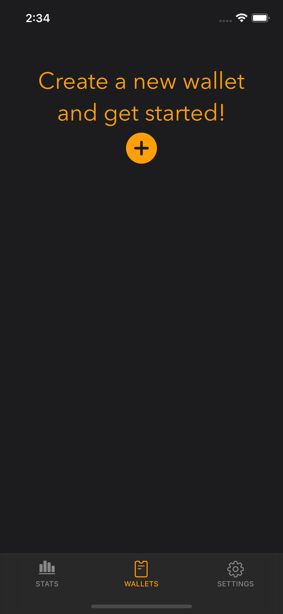
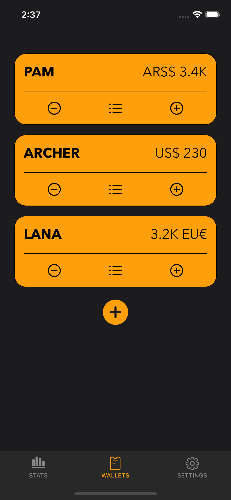
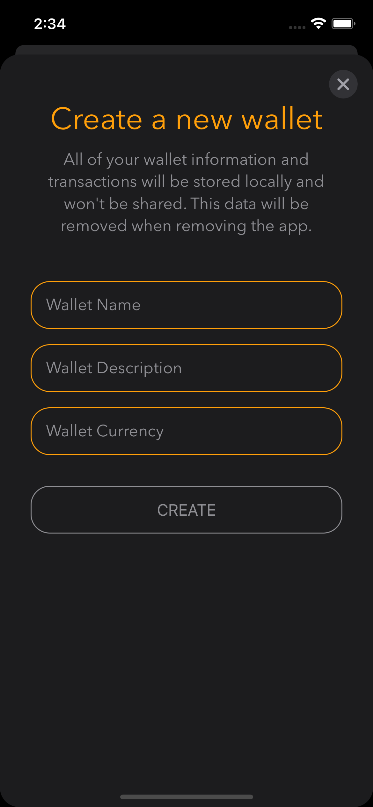
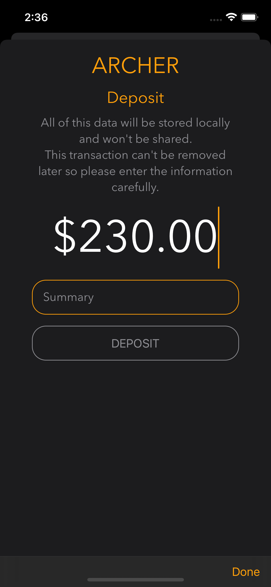
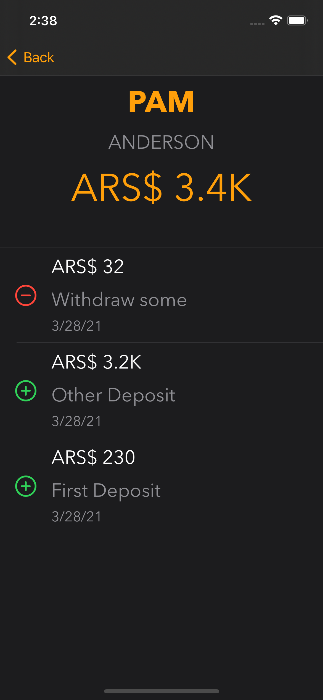
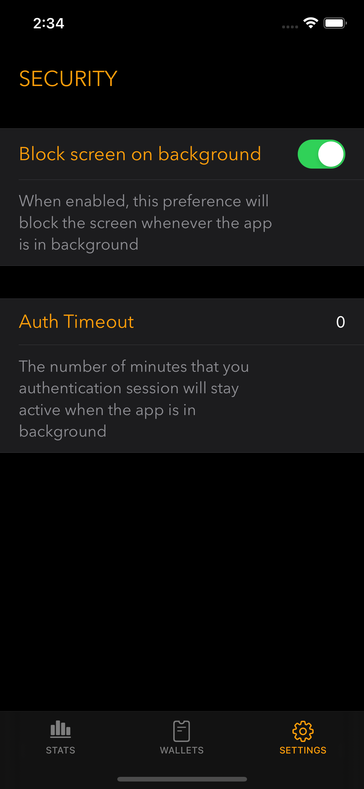

# Beskar App

## An iOS App to keep track of money

 

Icon by [Thano Sipsis's Dribble](https://dribbble.com/Thano9)

| Empty Wallet List | Wallet List | New Wallet |
| --- | --- | --- |
|  |  |  |
| Deposit | Wallet Details | Settings |
|  |  |  |

## Summary

An app to manage wallets in the simplest way.

Provides the ability to create wallets with three different kinds of currencies: **USD**, **ARS** and **EU**.
As of now, it only provides the ability to **deposit** and **withdraw** from these wallets.
In the future, the idea would be to provide *stats* to understand and predict wallet movements.

## Patterns & Practices

- Model-View-ViewModel with [Combine](https://developer.apple.com/documentation/combine) to manage views and business logic
- [Coordinator pattern](https://www.raywenderlich.com/books/design-patterns-by-tutorials/v3.0/chapters/23-coordinator-pattern) to manage navigation
- Property dependency injection using [Swinject](https://github.com/Swinject/Swinject)
- Namespaced extensions in first party dependencies
- Decorator pattern to inject logic into first party models

## Modules

- [Beskar](./Beskar): App module
- [BeskarUI](./BeskarUI): Beskar Design System with helpers around views and navigation
- [BeskarKit](./BeskarKit): Beskar Data Services and Models

## Third Party

- [RealmSwift](https://github.com/realm/realm-cocoa) (Realm DB)
- [TinyConstraints](https://github.com/roberthein/TinyConstraints) (Constraints suggar)
- [SwiftyBeaver](https://github.com/SwiftyBeaver/SwiftyBeaver) (Loggin)
- [Nimble](https://github.com/Quick/Nimble) (Unit Test matching)
- [Swinject](https://github.com/Swinject/Swinject) (DI)
- [Eureka](https://github.com/xmartlabs/Eureka) (Settings Table View)
- [IQKeyboardManager](https://github.com/hackiftekhar/IQKeyboardManager) (Auto-Keyboard Management)
- [Loaf](https://github.com/schmidyy/Loaf) (Easy iOS Toasts with Loaf)

## Tools

Several tools and utils can be found in the [Scripts](./Scripts) folder.

- [Mint](https://github.com/yonaskolb/Mint) Package Manager
- [SwiftLint](https://github.com/realm/SwiftLint)
- [fromkk/SpellChecker](https://github.com/fromkk/SpellChecker)

## CI

[Github Actions](https://docs.github.com/en/actions) CI Pipeline with the following steps:

- Build
- Unit Test
- Lint All Files
- SpellCheck All Files
- Verify Code Coverage and send results to [codecov](https://codecov.io/gh/rusito-23/BeskarApp)
